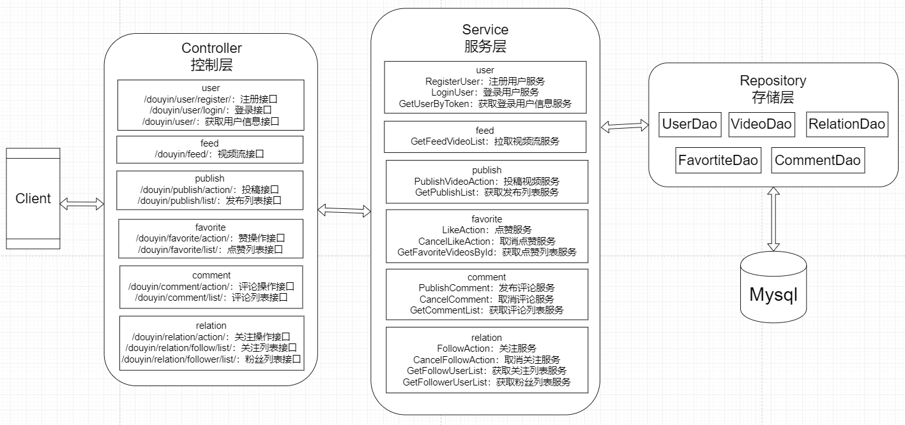

# simple_tiktok

## 文件夹结构

```
simple_tiktok
|-- controller          // 控制器层，主要负责接受客户端的请求，并调用服务层的服务进行处理，返回响应
  |-- comment_test.go
  |-- comment.go        // 评论或取消评论接口、获取评论列表接口
  |-- favorite_test.go
  |-- favorite.go       // 点赞或取消点赞接口，获取喜欢列表接口
  |-- feed_test.go
  |-- feed.go           // 拉取视频接口
  |-- publish_test.go
  |-- publish.go        // 发布视频接口、获取作品列表接口
  |-- relation_test.go
  |-- relation.go       // 关注或取消关注接口，获取关注列表或粉丝列表接口
  |-- user_test.go
  |-- user.go           // 用户登录注册接口、获取用户信息接口
|-- global              // 全局数据文件夹
  |-- common.go         // 全局会使用到的一些结构体
  |-- config.go         // 全局配置
|-- public              // 用户投稿视频后保存在本地的文件夹
  |-- bear.mp4          // 本地视频文件，熊的视频
|-- repository          // 存储层，主要负责将数据保存在合适的结构体里并与数据库进行交互
  |-- comment_dao.go    // 包含评论相关结构体和数据库方法
  |-- db_init.go        // 初始化数据库
  |-- demo_data.go      // demo数据，包括导入方法
  |-- favorite_dao.go   // 包含点赞相关结构体和数据库方法
  |-- relation_dao.go   // 包含关注相关结构体和数据库方法
  |-- user_dao.go       // 包含用户信息相关结构体和数据库方法
  |-- video_dao.go      // 包含视频相关结构体和数据库方法
|-- service             // 服务层，主要负责调用存储层相关方法为控制器层进行相关逻辑处理，返回控制器层所需结果
  |-- comment.go        // 评论功能相关
  |-- favorite.go       // 点赞功能相关
  |-- feed.go           // 拉取视频功能相关
  |-- publish.go        // 投稿视频功能相关
  |-- relation.go       // 关注功能相关
  |-- user.go           // 登录注册、获取用户信息相关
|-- main.go
|-- router.go
```

## 运行方式

### 运行环境

+ 服务端：Windows\Linux\Mac
+ 客户端：安卓虚拟机\真机
+ Go版本：Go 1.17+
+ 数据库：mysql 8.0+

### 运行步骤

#### 1. 设置服务器url和数据库相关信息

首先在`global/config.go`全局配置文件中，修改变量`ServerUrl`的值，设置服务器的url，如`var ServerUrl = "http://127.0.0.1:8080/"`，设置连接数据库的用户名`SqlUsername`、密码`SqlPassword`、数据库名`SqlDBName`，如果需要直接导入demo数据的话，设置导入demo数据使用的数据库名`SqlDemoDBName`（使用Demo数据会先清空之前的数据库再导入数据，如果想使用之前程序保存在数据库中的数据，需要使用名`SqlDBName`的普通数据库）

#### 2. 启动服务端

在终端进入`simple_tiktok`文件目录下，输入

```
go run main.go router.go
```

如果需要使用demo数据库并导入demo数据，输入

```
go run main.go router.go --demo
```

即可在默认的8080端口运行起来服务端

#### 3. 启动客户端

在安卓虚拟机或真机中安装`app-release.apk`，然后在客户端打开软件，连续点击右下方的“我”2~3次，弹出“高级设置”界面，设置服务器url，和之前在`global/config.go`文件中设置的服务器url一样，如`http://127.0.0.1:8080/`，点击保存并重启，退出软件，再点击进入，即可完成相应设置


## 功能说明

+ 登录、注册功能：每次启动程序会将用户信息导入到内存中，方便其它功能查询，注册会同时更新内存和数据库中的用户信息
+ 视频 Feed 流：支持所有用户刷抖音，包括未登录的用户，视频按照投稿时间倒序推出，单词最多30个
+ 视频投稿：要求用户必须处在登录状态，可以选择自己拍的视频上传，视频上传后会保存到本地 public 目录中，访问时用 127.0.0.1:8080/static/video_name 即可
+ 个人信息：登录用户可以在个人信息页查看自己的用户信息，包括用户名、关注数和粉丝数等
+ 点赞功能：登录用户可以对视频点赞或取消点赞，在个人主页能够查看点赞视频列表，未登录状态下也可以看到视频的总点赞数
+ 评论功能：登录用户可以对视频评论，未登录状态下可以看到视频的总评论数，也可以查看所有用户的评论，按发布时间倒序
+ 关注功能：登录用户可以关注或取消关注其他用户，可以在个人信息页点击打开关注列表和粉丝列表

## API接口文档

[API接口文档](https://www.apifox.cn/apidoc/project-1014925/api-20967126)

## 实现思路

### 整体设计


整体设计上，将程序分为控制层、服务层和存储层，控制层负责接口设计，接收来自客户端的请求，使用接收到的请求数据参数调用服务器层的方法进行处理，并最后响应结果；服务层负责具体处理业务逻辑，使用存储层的数据结构和方法与数据库进行交互，为控制层提供服务；存储层负责使用合适的数据结构存储信息，并提供与数据库进行交互的方法，使服务层可以利用；使用的存储数据库是Mysql。

### 数据库设计

数据库使用的数据结构和交互相关的代码文件放在`repository`文件夹中，设计了5个表，分别是用户信息表`users`、视频信息表`videos`、评论信息表`comments`、点赞视频信息表`favorite_videos`、关系信息表`follows`。

#### 1. 用户信息表users

用户信息表users使用到的用户信息结构体`UserDao`仿照程序使用的`global/common.go`文件中的用户结构体`User`进行设计，放在`repository/user_dao.go`文件中，设置用户ID为自增主键：

```go
// 用户信息表users
type UserDao struct {
	Id            int64  `json:"id" gorm:"primary_key;AUTO_INCREMENT"`
	Name          string `json:"name"`
	FollowCount   int64  `json:"follow_count"`
	FollowerCount int64  `json:"follower_count"`
	IsFollow      bool   `json:"is_follow"`
	Token         string `json:"token"`
}

func (UserDao) TableName() string {
	return "users"
}
```

**索引选择：**

其次有两个map，即`usersLoginInfo`和`userIdToToken`，分别存储用户token与用户User结构体的对应关系和存储用户Id与用户token的对应关系，每次启动程序时，都会将数据库中的用户信息导入这两个map中，可以用来根据用户的Id或token找到具体的User结构体：

对于用户信息表users，主要的操作是当程序启动时，将数据库中保存的用户信息加载到内存中的分别存储用户token与用户User结构体的对应关系的`usersLoginInfo`，和存储用户Id与用户token的对应关系的`userIdToToken`两个map中，可以根据用户的Id或token找到具体的User结构体，不用从数据库中进行查找，还有注册时向其中插入一条用户记录，并在内存的两个map中进行记录，对数据库大部分是更新操作，所以不用添加索引。

#### 2. 视频信息videos表

视频信息表videos使用到的视频结构体`VideoDao`仿照程序使用的`global/common.go`文件中的视频结构体`Video`进行设计，放在`repository/video_dao.go`文件中，`Video`的`User`类型字段`Author`改成了`int64`类型的字段`AuthorId`，在数据库中只存储视频作者的用户Id，当要获取这个作者的具体用户信息时，通过`userIdToToken`首先将用户Id转成用户token，然后再用token从`usersLoginInfo`中找到具体的用户信息，同时新加了一个`PublishTime`字段用来表示投稿时间，放在`repository/video_dao.go`文件中，设置视频ID为自增主键：

```go
// 视频信息表videos
type VideoDao struct {
	Id            int64  `json:"id,omitempty" gorm:"primary_key;AUTO_INCREMENT"`
	AuthorId      int64  `json:"author_id,omitempty" gorm:"index"`
	PlayUrl       string `json:"play_url,omitempty"`
	CoverUrl      string `json:"cover_url,omitempty"`
	FavoriteCount int64  `json:"favorite_count,omitempty"`
	CommentCount  int64  `json:"comment_count,omitempty"`
	IsFavorite    bool   `json:"is_favorite,omitempty"`
	Title         string `json:"title,omitempty"`
	PublishTime   int64  `json:"publish_time,omitempty" gorm:"index:,sort:desc"`
}

func (VideoDao) TableName() string {
	return "videos"
}
```

**索引选择：**

对于videos表，主要的操作是当调用Feed接口时，从数据库中根据`publish_time`字段查找小于`lastestTime`的视频，并按`publish_time`倒序排列，最多返回30个视频，以及调用返回作品列表PublishList接口时，根据`author_id`字段查找用户发布所有视频，还有发布视频时，向数据库中插入新的记录，因为拉取视频和查看个人页作品列表的频率应该远远高于发布视频的频率，一个人发布视频可能有上千个人看，在查询性能和更新性能之间应该更加偏向于查询性能，所以应该要在`publish_time`字段添加一个倒序索引，并在`author_id`字段添加一个索引，进行基准测试时，需要使用Demo数据库并导入Demo数据，每次都先删除整个数据库再建立数据库，以保证每次建立的表格按照要求建立索引，结果如下：



可以看到，向`publish_time`字段上添加倒序索引，在调用Feed接口时性能要比不添加索引或添加正序索引好一些，所以应该往`publish_time`字段上添加倒序索引。


可以看到，向`author_id`字段上添加索引，在调用返回作品列表的PublishList接口时性能要比不添加索引好一些，所以应该往`author_id`字段上添加索引。

#### 3. 点赞视频信息favorites表

点赞视频信息表favorites使用到的视频结构体`FavoriteDao`有两个字段，分别是给这个视频点赞的用户token和这个视频的Id，放在`repository/favorite_dao.go`文件中：

```go
// 点赞视频信息表favorites
type FavoriteDao struct {
	Token   string `json:"token" gorm:"index"`    // 用户的token
	VideoId int64  `json:"video_id" gorm:"index"` // 用户点赞的视频Id
}

func (FavoriteDao) TableName() string {
	return "favorites"
}
```

**索引选择：**

对于favorites表，主要的操作是当调用FavoriteAction接口进行点赞或取消点赞行为，或调用FavoriteList接口返回点赞列表时，需要根据`token`和`video_id`字段从数据库中查找对应token用户点赞过的所有视频id，点赞或取消点赞时从数据库中根据`token`和`video_id`字段删除相应记录，所以需要在查找和更新性能之间进行取舍，通过基准测试决定是否应该在`token`和`video_id`字段建立索引，结果如下：


可以看到，向`token`和`video_id`字段添加索引，总体性能要好一点，所以应该往`token`和`video_id`字段上都添加索引。

#### 4. 评论信息comments表

评论信息表comments使用到的评论结构体`CommentDao`仿照程序使用的`global/common.go`文件中的视频结构体`Comment`进行设计，`Comment`的`User`类型字段`User`改成了`int64`类型的字段`UserId`，在数据库中只存储评论者的Id，当要获取这个评论者的具体用户信息时，通过`userIdToToken`首先将用户Id转成用户token，然后再用token从`usersLoginInfo`中找到具体的用户信息，同时新加了`VideoId`字段表示视频，`PublishTime`字段用来表示评论时间，放在`repository/comment_dao.go`文件中，设置评论ID为自增主键：

```go
// 评论信息表comments
type CommentDao struct {
	Id          int64  `json:"id" gorm:"primary_key;AUTO_INCREMENT"`
	UserId      int64  `json:"user_id"`
	VideoId     int64  `json:"video_id" gorm:"index"`
	Content     string `json:"content"`
	CreateDate  string `json:"create_date"`
	PublishTime int64  `json:"publish_time" gorm:"index:,sort:desc"`
}

func (CommentDao) TableName() string {
	return "comments"
}
```

**索引选择：**

对于comments表，主要的操作是当调用CommentAction接口进行评论或取消评论行为，需要向数据库中插入或删除相应的评论记录，或调用CommentList接口返回视频评论列表时，需要根据`video_id`查找视频所有的评论记录，并按`publish_time`字段倒序返回从数据库中查找对应token用户点赞过的所有视频id，所以应该在`video_id`字段建立索引，并在`publish_time`字段建立倒序索引基准测试如下：


可以看到，向`video_id`字段建立索引和向`publish_time`字段建立倒序索引，总体性能要好一点，所以应该往`video_id`字段建立索引和往`publish_time`字段建立倒序索引。

#### 5. 关系信息relations表

关注或取消关注过程中使用到的与数据库进行交互的用户信息结构体是`RelationDao`有两个字段，分别是给这个关注者的用户id和被关注者的用户id，放在`repository/relation_dao.go`文件中：

```go
// 关系信息表relations
type RelationDao struct {
	UserId   int64 `json:"user_id" gorm:"index"`    // 关注者的用户Id
	ToUserId int64 `json:"to_user_id" gorm:"index"` // 被关注者的用户Id
}

func (RelationDao) TableName() string {
	return "relations"
}
```

**索引选择：**

对于relations表，主要的操作是当调用RelationAction接口进行关注或取消关注行为，需要在数据库中建立或删除相应的记录，或调用FollowList接口和FollowerList返回关注列表和粉丝列表时，需要根据`user_id`和`to_user_id`字段从数据库中查找对应的关注记录，所以需要在查找和更新性能之间进行取舍，通过基准测试决定是否应该在`user_id`和`to_user_id`字段建立索引，结果如下：


可以看到，向`user_id`和`to_user_id`字段上添加索引，总体性能要好一点，所以应该往`user_id`和`to_user_id`字段上都添加索引。

### 服务层功能实现思路

#### 1. 登录、注册功能

注册时，首先判断用户名或密码是否超过32个字符，超过则直接返回注册失败，接着判断用户是否存在，如果用户已经存在，直接返回注册失败，否则将注册用户的用户名填入`Name`属性，用户名拼接加密的密码组成`Token`属性，`FollowCount`、`FollowerCount`为0，`IsFollow`为`false`构成的UserDao对象直接插入数据库中的`users`表中，并在`usersLoginInfo`和`userIdToToken`记录新注册用户的对应关系。

登录时，首先根据用户名拼接加密的密码组成token，然后在`usersLoginInfo`中搜索是否存在这个token，存在则可以从`usersLoginInfo`中根据token取出用户信息并返回，找不到token则返回用户不存在。

#### 2. 视频 Feed 流

当拉取视频时，首先获取限制返回视频的投稿时间戳`latest_time`，如果没有设置，则默认为当前时间，然后找到投稿时间不晚于lastestTime的投稿视频，按投稿时间倒序排列，最多30个，如果没有直接返回nil，接着获取用户点赞的视频列表，并存储在map中，根据投稿视频是否在这个点赞的视频列表中，设置获取的投稿视频的是否点赞`IsFavorite`属性，并记录本次返回的视频中，发布最早的时间`nextTime`，作为下次请求时的`latest_time`

#### 3. 视频投稿

当投稿时，首先获取token，判断是否处于登录状态，不是则直接返回，取消发布视频，否则获取发布的视频文件数据，将视频文件经过文件路径和命名处理后存入本地的`public`文件夹目录下，同时将相应的视频信息组成一个`VideoDao`插入数据库的`videos`表中，其中播放路径`PlayUrl`由放在`common.go`文件中的服务器url、`static/`、文件最终名字`finalName`组成，发布时间通过`time.Now().Unix()`方法获取，即为当前时间。

当获取发布作品列表时，首先从数据库中的`videos`表根据用户id获取这个用户发布的视频列表，因为这个用户有可能对自己的视频点赞，所以也要获取这个用户点赞的视频列表，设置视频列表中的视频的`IsFavorite`是否点赞属性后返回这个用户发布视频列表。

#### 4. 个人信息

在登录时会获取个人信息，首先在`usersLoginInfo`中查找token，如果找不到返回用户不存在，找到则从`usersLoginInfo`中根据token取出用户信息并返回。

#### 5. 点赞功能

当点赞或取消点赞时，首先获取token，判断是否处于登录状态，不是则直接返回，否则先根据token获取这个用户点赞的视频列表，判断用户是否对当前视频点过赞了，如果是点赞行为且之前没有给这个视频点过赞，那么将数据库中`videos`表的这个视频的总点赞数加一，并在`favorites`点赞视频表中创建相应点赞记录，之前点过赞则不作反应，直接返回；如果是取消点赞行为且之前给这个视频点过赞了，那个更新数据库中的视频总点赞数，删除点赞记录，之前没点过赞则不作反应，直接返回。

当获取点赞列表时，首先根据用户Id从`userIdToToken`中获取用户token，然后根据用户token从数据库的`favorites`表中获取这个用户点赞的所有视频，最后返回。

#### 6. 评论功能

当进行评论或取消评论时，首先获取token，判断是否处于登录状态，不是则直接返回，如果是评论行为，首先获取当前日期作为创建日期，获取当前时间作为发布时间，然后向评论信息表中插入相应的评论记录，并更新视频信息表中相应视频的评论数加一；如果是取消评论行为，则从评论信息表中删除相应的记录，并更新视频信息表中相应视频的评论数减一。

当获取视频的所有评论时，从数据库的`comments`表中根据视频id获取按发布时间倒序的所有评论，然后从从记录账号信息的`usersLoginInfo`和`userIdToToken`根据用户Id获取具体的评论用户信息，设置获取的评论列表中评论作者字段，返回相应的评论列表。

#### 7. 关注功能

当进行关注或取消关注时，首先获取token，判断是否处于登录状态，不是则直接返回，否则先根据token获取这个用户的Id，如果是用户自己关注或取关自己，则不能操作，直接返回，否则继续，如果是关注行为，那么在数据库的`relations`表中创建相应的记录，在`users`表中更新关注用户和被关注用户的关注数和被关注数；如果是取消关注行为，那么在数据库的`relations`表中删除相应的记录，在`users`表中更新关注用户和被关注用户的关注数和被关注数，对数据库操作完后，同时也要更新内存中的存储账号信息`usersLoginInfo`的map中相应用户的关注数、被关注数、是否被关注等信息。

当获取关注列表或粉丝列表时，从数据库的`relations`表中根据用户Id获取所有这个用户关注或关注这个用户的用户Id，然后从从记录账号信息的`usersLoginInfo`和`userIdToToken`根据用户Id获取具体的关注或粉丝用户信息，如果是获取粉丝列表，还需要从数据库中根据用户id获取这个用户关注的所有用户，判断这个用户是否关注了粉丝，设置粉丝的`IsFollow`是否关注属性，然后返回获取的用户列表。

## 功能展示

[登录、注册功能演示视频](http://120.79.66.18:8080/static/videos/%E7%99%BB%E5%BD%95%E3%80%81%E6%B3%A8%E5%86%8C%E5%8A%9F%E8%83%BD.mp4)

[拉取视频流功能演示视频](http://120.79.66.18:8080/static/videos/%E6%8B%89%E5%8F%96%E8%A7%86%E9%A2%91%E5%8A%9F%E8%83%BD.mp4)

[投稿功能演示视频](http://120.79.66.18:8080/static/videos/%E6%8A%95%E7%A8%BF%E5%8A%9F%E8%83%BD.mp4)

[获取作品列表和喜欢列表演示视频](http://120.79.66.18:8080/static/videos/%E8%8E%B7%E5%8F%96%E4%BD%9C%E5%93%81%E5%88%97%E8%A1%A8.mp4)

[点赞功能演示视频](http://120.79.66.18:8080/static/videos/%E7%82%B9%E8%B5%9E%E5%8A%9F%E8%83%BD.mp4)

[评论功能演示视频](http://120.79.66.18:8080/static/videos/%E8%AF%84%E8%AE%BA%E5%8A%9F%E8%83%BD.mp4)

[关注功能演示视频](http://120.79.66.18:8080/static/videos/%E5%85%B3%E6%B3%A8%E5%8A%9F%E8%83%BD.mp4)

这里导入Demo数据进行展示，Demo数据写在`controller/demo_data.go`文件中，使用数据库`demo_simple_tiktok`存放导入的Demo数据，在服务器终端输入`go run main.go router.go --demo`即可导入Demo数据，在Demo数据中：

+ 有5个用户user1、user2、user3、user4、user5，用户名和密码分别为：
  + 用户名：user1，密码：111111
  + 用户名：user2，密码：222222
  + 用户名：user3，密码：333333
  + 用户名：user4，密码：444444
  + 用户名：user5，密码：555555
+ 有31个视频，视频Id从1到31，每个视频的发布时间也是从1到31，与Id一样，第一个Id为1的视频是Bear.mp4熊视频，存放在本地，其它视频的播放路径都来自网络，节省仓库存储空间，每个视频的作者分别为：
  + Id为1（熊视频）、6、11、16、21、26的视频作者为user1
  + Id为2（橙子视频）、7、12、17、22、27的视频作者为user2
  + Id为3、8、13、18、23、28的视频作者为user3
  + Id为4、9、14、19、24、29的视频作者为user4
  + Id为5、10、15、20、25、30、31（甜甜圈视频）的视频作者为user5
+ 视频点赞情况为：
  + Id为31的视频（甜甜圈视频）有user3、user4、user5三个用户点赞
  + Id为30的视频有user1、user2两个用户点赞
  + Id为29的视频有user3、user4、user5三个用户点赞
  + Id为2的视频（橙子视频）有user5一个用户点赞
  + Id为1的视频（熊视频）有user1、user2、user4三个用户点赞
+ 视频评论情况为：
  + Id为31的视频（甜甜圈视频）有user1、user2、user3、user4、user5五个用户评论：
    + user1在时间50评论
    + user2在时间49评论
    + user3在时间48评论
    + user4在时间47评论
    + user5在时间46评论
  + Id为30的视频有user1、user2两个用户评论：
    + user3在时间45评论
    + user4在时间44评论
  + Id为2的视频（橙子视频）有user3、user4两个用户评论：
    + user3在时间43评论
    + user4在时间42评论
  + Id为1的视频（熊视频）有user5一个用户评论：
    + user5在时间41评论
+ 关注情况为：
  + user1关注了：user2
  + user2关注了：user3
  + user3关注了：user4
  + user4关注了：user1、user5
  + user5关注了：user1

### 1. 登录、注册功能：


一开始在Demo数据库中，没有test1这个用户，所以当进行登录时，显示用户不存在，登录失败，然后进行注册，使用用户名`test1`和密码`123456`注册成功之后，退出登录，回到登录页面后，以用户名`test1`和密码`1234567`进行登录时，因为密码错误，所以登录失败，将密码改变成`123456`之后，登录成功

### 2. 视频 Feed 流


在无登录状态下，打开软件，拉取视频流，因为Demo数据库中的视频一共有31个，Id由1到31，投稿时间与Id相同，在每个视频左下角的内容中有每个视频的序号和发布时间，所以应该拉取到的视频是发布时间从31到2的第31号到第2号视频，可以看到，进入软件后，第一个视频就是第31号视频（甜甜圈视频，左下角显示是第31号视频，发布时间为31），之后继续向下划动屏幕，可以看到，依次是第30号视频和第29号视频，往上划动又是第30号和第31号视频，一直往下划动，直到最后一个发布时间为2的第2号视频（橙子视频），可以看到，继续向下划动，出现的仍是第2号视频，说明这批视频中第2号视频是最后一个视频，刚好30个，符合一次最多返回30个视频，按投稿时间倒序排列的要求，在最后一个视频继续向下划动，会重新拉取视频流，以上次返回的视频中，发布最早的时间，作为下次请求时的latest_time，此时返回的应该是第2号视频和第1号视频（熊视频），所以之前第2号视频继续向下划动，依然是第2号视频，此时作为下一批视频的开头。

### 3. 视频投稿


用户test1在登录状态下，进行投稿，选择了本地的椰子视频，视频内容为good，投稿完成后，重新打开软件拉取视频流，可以看到，第一个视频就是刚刚投稿的视频，将服务器停止后，重新打开服务器，要在`repository/db_init.go`中设置使用的数据库名`SqlDBName`为Demo数据库`demo_simple_tiktok`，然后在终端输入`go run main.go router.go`，重新启动服务器，再打开软件，看到第一个视频仍是刚刚投稿的视频，说明视频保存在了本地，路径保存在了数据库中，实现了持久化存储。

### 4. 个人信息


点击右下方的我，可以看到登录用户的关注、粉丝、作品、喜欢等情况，在视频页面向右划动，则可以看到每个视频作者的个人信息，包括关注、粉丝、作品、喜欢等。

### 5. 点赞功能


首先登录user1用户，根据Demo数据，user1没有给Id为31的甜甜圈视频点赞，但给了下一个Id为30的视频点赞，可以看到，user1在甜甜圈视频的点赞按钮并没有被点亮，点赞后，user5的个人界面中显示有一获赞，而user1个人页面中的喜欢列表中也出现了甜甜圈视频，再给甜甜圈视频取消点赞，可以看到user5的个人界面中显示去掉获赞，而user1个人页面中的喜欢列表中甜甜圈视频也消失了，再给甜甜圈视频点赞，此时甜甜圈视频的点赞数为4，往下划到第30个视频，user1之前给这个视频点过赞，所以点赞按钮是亮着的，退出登录user1用户后重新登录user5用户，可以看到此时甜甜圈视频的点赞数已经变成了4，由于客户端问题，本来user5应该是给甜甜圈视频点过赞的，但是点赞按钮没亮，此时点击点赞按钮，服务器会阻止点赞行为，显示之前已经点过赞了，向下划动到第30号视频，给其点赞，可以看到user5的喜欢列表中也出现了这视频。

### 6. 评论功能


首先登录user5用户，点开甜甜圈视频的评论列表，可以看到，获取的评论按照时间倒序排列，接着给甜甜圈视频进行评论，评论成功后，由于评论时间是最新的，所以评论会去到评论列表的最上方，长按取消评论，可以看到，取消评论功能也是正常，再评论一次，内容为`hey`，然后退出并重新登录user1用户，可以看到，甜甜圈视频的评论数变成了6，点开甜甜圈视频的评论列表，可以看到user5的评论也在评论列表里，user1也可以对甜甜圈视频进行评论。

### 7. 关注功能


首先登录user1，根据Demo数据，user1关注了user2，而user4、user5关注了user1，可以看到个人界面，user1的关注数为1，粉丝数为2，符合Demo数据，点开关注列表后，看到关注和粉丝的用户以及关注状态也和Demo数据相同，然后点击关注user5，可以看到，关注列表多了user5，粉丝列表中user5的关注状态也为已经关注，再关注user4，可以看到，关注列表和关注状态也做了相应的更新，符合要求，取关user4，功能也是正常，然后退出并重新登录user5用户，因为刚刚被user1关注，可以看到，user5的粉丝列表中也出现了user1，关注状态也为已经关注。

## 安全问题考虑

### 越权问题

一开始选择的登录凭证token的构造方式是登录用户的username和password直接拼接而成，这种方式存在一定的安全风险，比如当一个用户的用户名为`user`，密码为`123456789`时，它的登录凭证token为`user123456789`，如果另一个用户名为`user123`的用户，使用密码`.456789`进行登录时，就可以构造出同样的`user123456789`登录凭证token，从而对用户`user`进行超过权限的操作。

为了解决出现的越权问题，这里选择了username和经过sha256算法加密后的password进行拼接构造登录凭证token的方案，这样一来，当用户名不同时，很难通过拼接密码获取相同的登录凭证，而每个token的前缀都是username，即使两个合法用户的用户名加密码可能相同，它们的登录凭证也不同，一定程度上保证了每个token的唯一性，同时当数据库发生泄露时，盗取数据的人也很难通过加密后的password推出原来的密码，一定程度上保护了用户的安全。

### 数据库注入问题

为了防止数据库注入，这里使用了gorm框架的参数化查询方法进行避免，而不是直接拼接sql语句，gorm框架的参数化查询会对sql语句进行预编译，而不是直接进行拼接，将用户输入的值用`?`占位符代替，之后运行时再传入用户输入的数据，除了防止sql注入以外，还可以对预编译的sql语句进行缓存，运行时就省去了解析优化sql语句的过程，可以加速sql的查询，提高查询性能。

其次，注册时会根据用户名和经过sha256算法加密后的密码拼接形成一个登录凭证token，这个token和具体用户的对应关系被保存在内存的一个map中，每次启动程序时也会先将所有的账号信息从数据库中加载到内存的这个map中，当登录时，会首先从内存的这个map中查找是否存在对应的token，而不是直接通过数据库进行查询，这样一定程度上也避免了数据库注入的问题。